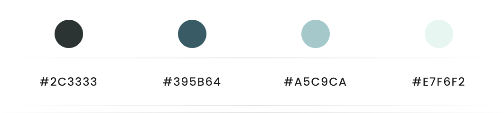
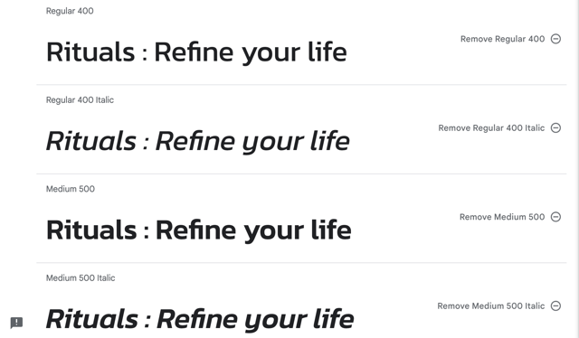
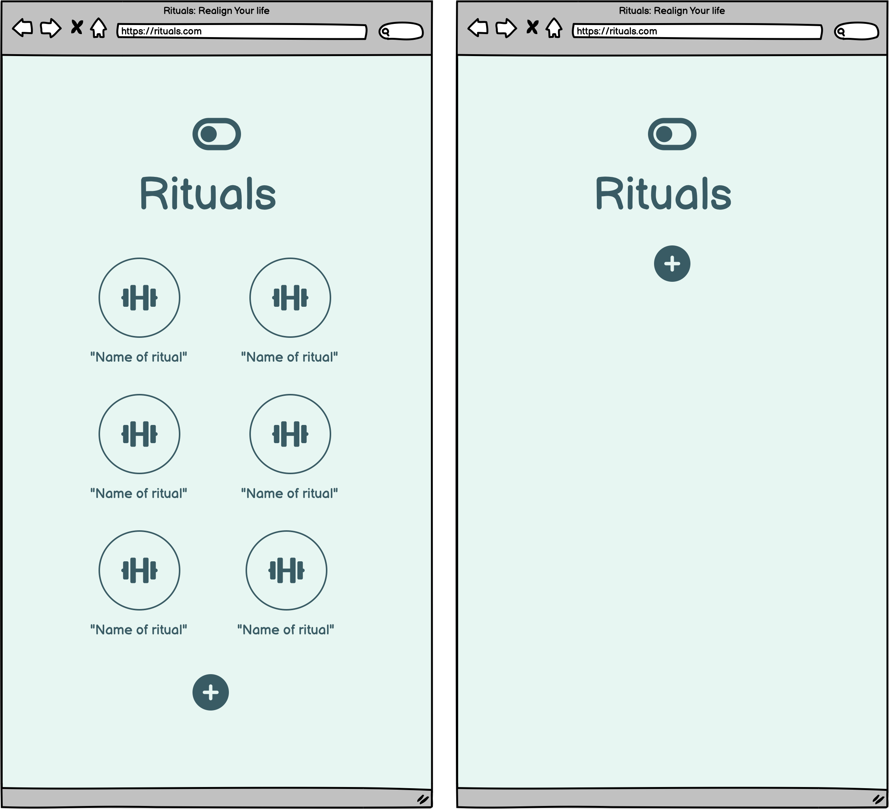
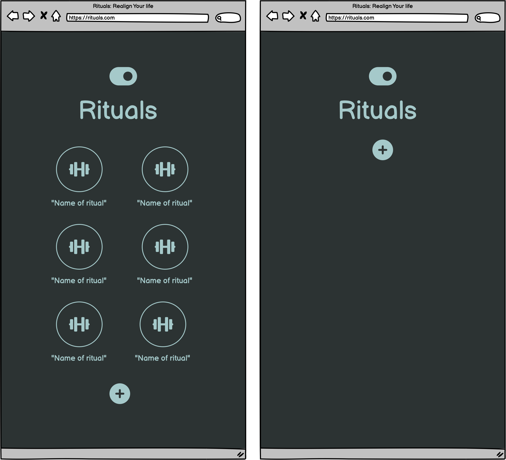

# Rituals : Realign Your Life

Rituals

This website can be accessed by this [link](https://omar-alme.github.io/habit-tracker-ritual/)

Here is a link to preview the website on all screens [Responsive Preview]()

## User Stories

### Visior goals:

- As a visitor, 
- As a visitor, 
- As a visitor, 
- As a visitor, 
- As a visitor, 
- As a visitor, 

## Features

## Design

### Color Scheme

### Typography

### Wireframes

#### Light Mode

#### Dark Mode

## Technologies Used

## Testing

## Manual Testing

### Bugs

## Validator testing
+ ### HTML
+ ### CSS

+ ### JS

+ ### Accessibility and performance 
#### Lighthouse

## Deployment

- The site was deployed to GitHub pages. The steps to deploy are as follows:
  - In the [GitHub repository](https://github.com/Omar-Alme/habit-tracker-ritual), navigate to the Settings tab
  - From the source section drop-down menu, select the **Main** Branch, then click "Save".
  - The page will be automatically refreshed with a detailed ribbon display to indicate the successful deployment.

The live link can be found [here](https://omar-alme.github.io/habit-tracker-ritual/)

## Local Deployment

In order to make a local copy of this project, you can clone it.
In your IDE Terminal, type the following command to clone my repository:

-      git clone https://github.com/Omar-Alme/habit-tracker-ritual

## Credits

- #### Content
  - https://stackoverflow.com/questions/45037844/arrange-2-items-per-row-using-flexbox
  - https://www.w3schools.com/howto/howto_js_toggle_dark_mode.asp
  - https://www.youtube.com/watch?v=TyITCYwsWHs
  - https://www.youtube.com/watch?v=gzCUq_VQ7Y8&t=176s
  - https://developer.mozilla.org/en-US/docs/Web/CSS/::after
  - 
- #### Media

## Acknowledgements

- I would like to acknowledge Chris Pennington for the design idea for the website. 
